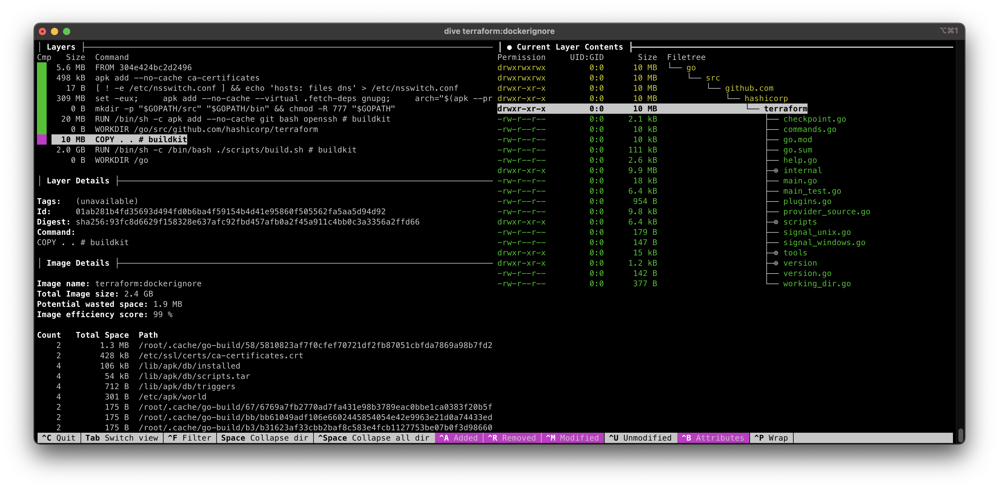

# Dockerfile best practices

- [1. Introduction](#1-introduction)
- [2. Small images](#2-small-images)
  - [2.1 Choose a base image](#21-choose-a-base-image)
  - [2.2 Remove package manager cache](#22-remove-package-manager-cache)
  - [2.3 Minimize the number of layers](#23-minimize-the-number-of-layers)
  - [2.4 Reduce the build context size](#24-reduce-the-build-context-size)
  - [2.5 Use multi-stage builds](#25-use-multi-stage-builds)

## 1. Introduction

Containers are a foundation of modern cloud-native workloads. While writing a Dockerfile
is easy, the best practices are often overlooked which leads to a sub-optimal
development experience, slow deployments and security risks.

This guide will show you common mistakes and key concepts to keep in mind when writing
your Dockerfiles so they produce small, fast and secure container images.

## 2. Small images

Container images should be as small as possible.

The advantages of a small container image are:

1. **Fast deployments**

   The application startup time is the combination of two factors:

   1. The time it takes to transfer the container image from the container registry to
      the worker node
   1. The time it takes to start the container

   You can create small container images that transfer faster to improve the application
   startup time.

1. **Savings in data transfer and storage**

   A small improvement in the container image size, in a modern Software Development
   Life Cycle (SDLC) with multiple builds and releases a day, can quickly compound into
   big savings on data transfer and storage required for such images.

1. **Improved security**

   A small image has a reduced attack surface and fewer vulnerabilities.

Follow these guides to build small container images.

### 2.1 Choose a base image

---

#### Official Images

Assume you have an application written in python. [Docker Hub](https://hub.docker.com)
provides several images to choose from. Look how they compare to each other.

Download different `python:3.10` images.

```bash
docker pull python:3.10-alpine3.14
docker pull python:3.10-slim-bullseye
docker pull python:3.10-bullseye
```

Compare the images size.

```text
$ docker images python
python       3.10-alpine3.14      c9e1987b6bc6   47 hours ago   45.4MB
python       3.10-slim-bullseye   0afc41689acc   2 days ago     125MB
python       3.10-bullseye        618fff2bfc18   2 days ago     915MB
```

Download their base images.

```bash
docker pull alpine:3.14
docker pull debian:bullseye-slim
docker pull debian:bullseye
```

Compare their base images size.

```text
$ docker images alpine
REPOSITORY   TAG       IMAGE ID       CREATED       SIZE
alpine       3.14      14119a10abf4   5 weeks ago   5.6MB
```

```text
$ docker images debian
REPOSITORY    TAG                IMAGE ID       CREATED        SIZE
debian        bullseye-slim      d40a74a77bd3   9 days ago     80.4MB
debian        bullseye           a178460bae57   9 days ago     124MB
```

Notice the following:

- The `python:3.10-alpine3.14` image adds **39.8MB** on top of its base image.
- The `python:3.10-slim-bullseye` image adds **44.6MB** on top of its base image.
- The `python:3.10-bullseye` image adds **791MB** on top of its base image.

This probably means that the default `python:3.10` image comes with a lot of
dependencies included which usually are not required by your application.

#### From scratch

There is a special base image named `scratch` that is empty and has a **0MB** size.

Languages like [Go](https://golang.org) and [Rust](https://www.rust-lang.org) produce
statically linked binaries by default.

You can add the resulting binary to the empty container like this:

```Dockerfile
FROM scratch
COPY hello /
CMD ["/hello"]
```

### 2.2 Remove package manager cache

---

A common mistake is to keep intermediary files in the container image that take space
but serve no purpose for the application.

The most common example is with package managers such as apt, yum, apk, pip.

Lets build a small example with flask.

#### Build with cache

```bash
$ docker build -t flask:cache <<EOF
FROM alpine:3.14
RUN apk add python3 py3-pip
RUN pip install flask==2.0.2
EOF
```

#### Build without cache

```bash
$ docker build -t flask:no_cache <<EOF
FROM alpine:3.14
RUN apk --no-cache add python3 py3-pip
RUN pip install --no-cache-dir flask==2.0.2
EOF
```

#### Size comparison

```text
$ docker images flask
REPOSITORY   TAG        IMAGE ID       CREATED         SIZE
flask        no_cache   c0cae32d14bb   2 minutes ago   72.9MB
flask        cache      5830db4fa064   7 minutes ago   75.8MB
```

This is a **2.9MB** reduction! Of course this is a small improvement but with bigger
containers with multiple dependencies these savings are compounded.

#### Layer analysis

Use the [dive](https://github.com/wagoodman/dive) tool to analyze each layer in the
containers.

```bash
dive flask:cache
```


```bash
dive flask:no_cache
```


Notice the following:

- There is **2.1MB** savings in the apk cache
- There is **0.8MB** savings in the pip cache

#### Snippets for common package managers

Refer to the following snippets when using package managers in your Dockerfiles.

##### apk

```Dockerfile
FROM alpine:3.14

RUN apk --no-cache add \
    package-1 \
    package-2 \
    package-3
```

##### apt-get

```Dockerfile
FROM debian:bullseye-slim

RUN apt-get update && apt-get install --no-install-recommends --assume-yes \
    package-1 \
    package-2 \
    package-3 \
    && rm -rf /var/lib/apt/lists/*
```

##### yum

```Dockerfile
FROM amazonlinux:2

RUN yum install -y \
    package-1 \
    package-2 \
    package-3 \
    && yum clean all
```

##### pip

```Dockerfile
FROM python:3.10-alpine

RUN pip install --no-cache-dir \
    flask==2.0.2
```

### 2.3 Minimize the number of layers

---

The instructions `RUN`, `COPY` and `ADD` create a new layer in the container image.

A common mistake is to add files in one layer and remove or modify them in a subsequent
layer. This only hides the old file from the image filesystem because the file is still
present in the previous layer.

Here are some examples:

#### Cache deleted in a different layer

```bash
$ docker build -t git:two_layers <<EOF
FROM debian:bullseye-slim
RUN apt-get update && apt-get install --no-install-recommends --assume-yes \
    git
RUN rm -rf /var/lib/apt/lists/*
EOF
```

#### Cache deleted in the same layer

```bash
$ docker build -t git:one_layer <<EOF
FROM debian:bullseye-slim
RUN apt-get update && apt-get install --no-install-recommends --assume-yes \
    git \
    && rm -rf /var/lib/apt/lists/*
EOF
```

#### Size comparison

```bash
$ docker images git
REPOSITORY   TAG          IMAGE ID       CREATED              SIZE
git          one_layer    22458aa1965c   5 seconds ago        154MB
git          two_layers   778a420efdad   About a minute ago   172MB
```

#### Layer analysis

```bash
dive git:two_layers
```


```bash
dive git:one_layer
```


Notice the following:

- The apt cache in `git:two_layers` was stored in one layer and hidden, not deleted, in
  the next layer.
- The apt cache in `git:one_layer` was never stored in any layer.

#### Permission set after COPY

```bash
KUBECTL_VERSION=v1.22.2
curl -o kubectl https://storage.googleapis.com/kubernetes-release/release/$KUBECTL_VERSION/bin/linux/amd64/kubectl

docker build -t kubectl:two_layers -f- . <<EOF
FROM alpine:3.14
COPY kubectl /
RUN chmod +x /kubectl
ENTRYPOINT ["/kubectl"]
EOF
```

#### Permission set before COPY

```bash
KUBECTL_VERSION=v1.22.2
curl -o kubectl https://storage.googleapis.com/kubernetes-release/release/$KUBECTL_VERSION/bin/linux/amd64/kubectl
chmod +x kubectl

docker build -t kubectl:one_layer -f- . <<EOF
FROM alpine:3.14
COPY kubectl /
ENTRYPOINT ["/kubectl"]
EOF
```

#### Size comparison

```text
$ docker images kubectl
REPOSITORY   TAG          IMAGE ID       CREATED              SIZE
kubectl      one_layer    ae25e7beefc3   14 seconds ago       52.5MB
kubectl      two_layers   6bd81d1619c9   About a minute ago   99.4MB
```

#### Layer analysis

```bash
dive kubectl:two_layers
```


```bash
dive kubectl:one_layer
```


Notice the following:

- The file is added twice in `kubectl:two_layers`
- The file is added once in `kubectl:one_layer`

### 2.4 Reduce the build context size

---

When you run a `docker build` command, the content of the current directory is sent to
the docker daemon as the _build context_.

The `terraform` repository has a demo Dockerfile that is useful to demonstrate this
concept.

```bash
$ git clone https://github.com/hashicorp/terraform
[...]

$ cd terraform

$ docker build -t terraform:no_dockerignore .
[+] Building 178.5s (11/11) FINISHED
=> [internal] load build definition from Dockerfile                                                                      0.1s
=> => transferring dockerfile: 849B                                                                                      0.0s
=> [internal] load .dockerignore                                                                                         0.1s
=> => transferring context: 2B                                                                                           0.0s
=> [internal] load metadata for docker.mirror.hashicorp.services/golang:alpine                                           3.5s
=> [internal] load build context                                                                                         4.6s
=> => transferring context: 213.56MB                                                                                     4.6s
=> [1/6] FROM docker.mirror.hashicorp.services/golang:alpine@sha256:c2335038e2230960f81cb2f9f1fc5eca45e23b765de1848c7b  16.2s
[...]
=> [2/6] RUN apk add --no-cache git bash openssh                                                                         4.9s
=> [3/6] WORKDIR /go/src/github.com/hashicorp/terraform                                                                  0.0s
=> [4/6] COPY . .                                                                                                        0.7s
=> [5/6] RUN /bin/bash ./scripts/build.sh                                                                              125.4s
=> [6/6] WORKDIR /go                                                                                                     0.0s
=> exporting to image                                                                                                   27.4s
=> => exporting layers                                                                                                  27.4s
=> => writing image sha256:65d70999e8bce7703add4c984363d5c551c6c556f6c3b9707b4653f4aba0dbb3                              0.0s
=> => naming to docker.io/library/terraform:no_dockerignore                                                              0.0s
```

Notice that we are transferring a build context of **213.56MB** from the docker client
to the docker daemon.

Analyze the `COPY . .` layer where the entire build context is being copied into the
container image.

```bash
dive terraform:no_dockerignore
```


Notice that there are multiple directories and files that are not required to build the
application but are being copied into and shipped with the container image.

#### .dockerignore file

The .dockerignore file allows you to exclude files and directories from the build
context.

This has many advantages such as:

1. **Fast builds:** There is less data to transfer from the docker client to the docker
   daemon.
2. **Secure images**: Prevent credentials or other secrets from being inadvertently
   copied into and distributed by the container image.
3. **Small images**: The container image is smaller when it does not contain unnecessary
   files.

Add a sample `.dockerignore` file for terraform and build the image again.

```bash
cat <<EOF > .dockerignore
*.md
.circleci
.dockerignore
.git
.github
.gitignore
.go-version
.tfdev
CODEOWNERS
Dockerfile
LICENSE
Makefile
codecov.yml
docs/
website/
EOF
```

```bash
$ docker build -t terraform:dockerignore .
[+] Building 155.5s (11/11) FINISHED
=> [internal] load build definition from Dockerfile                                                                      0.0s
=> => transferring dockerfile: 849B                                                                                      0.0s
=> [internal] load .dockerignore                                                                                         0.0s
=> => transferring context: 164B                                                                                         0.0s
=> [internal] load metadata for docker.mirror.hashicorp.services/golang:alpine                                           0.9s
=> [1/6] FROM docker.mirror.hashicorp.services/golang:alpine@sha256:c2335038e2230960f81cb2f9f1fc5eca45e23b765de1848c7b   0.0s
=> [internal] load build context                                                                                         0.7s
=> => transferring context: 10.37MB                                                                                      0.7s
=> CACHED [2/6] RUN apk add --no-cache git bash openssh                                                                  0.0s
=> CACHED [3/6] WORKDIR /go/src/github.com/hashicorp/terraform                                                           0.0s
=> [4/6] COPY . .                                                                                                        0.5s
=> [5/6] RUN /bin/bash ./scripts/build.sh                                                                                134.3s
=> [6/6] WORKDIR /go                                                                                                     0.0s
=> exporting to image                                                                                                    18.9s
=> => exporting layers                                                                                                   18.8s
=> => writing image sha256:2aa655068aee603bdc506f0eb7c4cb64594238755ac79b41eafbb2ce30a8cdaf                              0.0s
=> => naming to docker.io/library/terraform:dockerignore                                                                 0.0s
```

Notice that we are transferring a build context of **10.37MB** from the docker client to
the docker daemon.

```bash
dive terraform:dockerignore
```



Notice that the `COPY . .` layer has been reduced to **10MB**.

### 2.5 Use multi-stage builds

---

It is a good idea to build the application in a container. This way you can have
reproducible builds and don't have to worry about missing tools or mismatching versions.

But you don't need to include a _build environment_ in your container. All you need to
ship is a _run environment_.

Multi-stage builds allows you to create a container to build the artifact in one stage
and a container to run the artifact in a different stage.

Create an example with a very simple hello world app written in go.

#### Create the source file

```bash
cat <<EOF>hello.go
package main

import "fmt"

func main() {
  fmt.Println("hello world")
}
EOF
```

#### Single Stage - Ship build and run environment

```bash
docker build -t hello:single_stage -f- . <<EOF
FROM golang:1.17-alpine
WORKDIR /app
COPY hello.go .
RUN go build hello.go
ENTRYPOINT ["/app/hello"]
EOF
```

#### Multi Stage - Ship run environment

```bash
docker build -t hello:multi_stage -f- . <<EOF
FROM golang:1.17-alpine AS builder
WORKDIR /app
COPY hello.go .
RUN go build hello.go

FROM alpine:3.14 AS final
WORKDIR /app
COPY --from=builder /app/hello /app/hello
ENTRYPOINT ["/app/hello"]
EOF
```

#### Size comparison

```bash
$ docker images hello
REPOSITORY   TAG            IMAGE ID       CREATED         SIZE
hello        multi_stage    1bcedce00b31   8 seconds ago   7.36MB
hello        single_stage   2d66864d02ad   3 minutes ago   317MB
```
